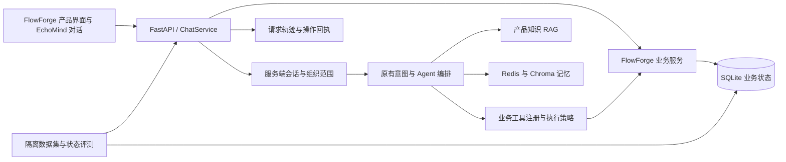

# EchoMind V2：可注册业务工具的 B2B SaaS 服务 Agent

> 实施进展（2026-09-09）：本文保留调研阶段的完整方案；已按 [实施 Spec](./spec-b2b-saas-v2.md) 完成 MVP，实际范围、测试与后续项见 [实施记录](./implementation-v2.md)。下述“未实现”描述对应原调研时点。

日期：2026-09-08。本版依据用户新增要求，替代 V1 的“只做内部分析助手”定位。**本次交付为更新后的方案、业务词汇和 ADR，不代表以下运行功能已实现。** 原代码核查仍以 `a2d77c3` 为参考，未修改运行代码。

阅读顺序：本方案 → [FlowForge 产品沙箱](./flowforge-sandbox-spec-2026-09-08.md) → [SaaS 工具一手调研](./saas-tooling-research-2026-09-08.md)。论文、开源及岗位基础调研保留在 [V1 来源](./research-sources-2026-09-08.md)，历史实现问题见 [V1 核查](./autumn-recruitment-optimization-2026-09-08.md)。

## 1. 定位与目标

**EchoMind 是面向 B2B SaaS 的可扩展服务 Agent：通过注册业务工具，完成产品功能咨询、API 对接支持、订阅/账单管理、企业账户管理，也保留交付、采用和续费分析。**

主要用户从“只服务 SaaS 内部分析人员”扩展为客户组织中的开发者、企业管理员、账单管理员，以及被明确授权的 SaaS 支持人员。Agent 根据用户任务选能力，系统根据身份决定能查什么、能改什么，两者职责不同。

FlowForge Cloud 是支撑这个 Agent 的虚构数据集成 SaaS。产品拥有自己的组织、成员、集成、套餐、账单和操作状态，UI 和 Agent 共用同一业务服务。注册的是业务能力，不要求接一个新业务就新增一个 Agent 或复制一套系统。

简历主线相应调整为：**有状态 SaaS 沙箱 + 工具可扩展的任务执行 + 证据/权限/操作回执 + 可验证最终状态的评测**。意图识别、多 Agent、RAG、记忆共同服务这条业务链。

## 2. 本次调研改变了哪些设计

| 来源 | 一手机制 | 本项目最小采用 | 不直接引入 |
|---|---|---|---|
| Stripe，S1–S3 | 订阅变更预览、幂等请求、测试时钟 | 具体变更预览、重复提交返回同结果、固定账期重放 | 真支付、税务与完整按比例计费 |
| Lago，S4 | 套餐、计费与用量领域模型 | 区分 plan/entitlement/usage/invoice，让 429 诊断有业务事实 | 独立部署整套开源计费平台 |
| Keycloak，S5 | 企业组织、身份和角色 | 服务端 membership 与有限操作权限 | 首版完整 SSO、SCIM、IdP |
| MCP，S6–S7 | 工具 schema/注解与授权边界 | 工具注册描述和执行策略分开；注解不能授予权限 | 不将本地工具 registry 宣称为 MCP 协议实现 |
| τ²-bench 与后续官方评测实现，S8–S9 | 工具交互与可检查的业务目标状态 | 固定初始数据库、交互过程、最终状态与必要告知检查 | 不要求模型逐字复刻唯一调用序列，不虚报榜单成绩 |

具体链接、来源边界和版本核验见 [S1–S9 调研](./saas-tooling-research-2026-09-08.md)。其中官方 τ2-bench 仓库主分支已演进，做复现必须固定论文对应版本；本项目只借鉴方法。

## 3. 最小架构与代码复用



这是模块化单体方案。复用 `agents/tools.py:AgentToolSpec`、`BaseAgent._call_llm`、`AgentOrchestrator`、现有 RAG/记忆、FastAPI 和 Vue。新增 `saas/` 包和独立 SQLite 状态库，用 Python 标准库即可起步；不新建微服务集群、消息队列或第二套 Agent SDK。

现有工具如 `check_entitlement_context` 返回 `entitlement_verified=false`，`lookup_error_code` 仅给通用规则，不能支撑“查我套餐”“读这条请求记录”“邀请同事”。新增 domain service 后，保留这些分析 helper，另注册真实查询和变更 adapter；不要悄悄让同名只读 helper 变成有副作用工具。

重要兼容点：当前 `AgentType.BILLING` 是 `SUCCESS="success"` 的枚举别名，不是独立计费 Agent。最小方案增加业务 `domain` 字段和能力清单，暂由 Success 角色承载 billing/account 能力并扩展 profile，Support 承载 integration，Triage/Delivery 承载 product/delivery，Renewal 保留。前端用业务 domain 展示，避免把历史类名当新产品名称。确有评测收益后再拆独立 BillingAgent/AccountAgent；不要直接修改枚举值破坏旧接口。

## 4. 工具注册：加一个业务应改哪些地方

在当前工具 spec 上增加可选元数据，或薄包装成 `BusinessToolSpec`，保留原 handler 签名的兼容 adapter：

```text
name / description / input_schema / output_schema
domain: product | integration | billing | account
effect: read | prepare | write
required_permission: subscription.read / subscription.change / member.invite ...
confirmation_policy: none | explicit_request | preview_required
timeout / retry_policy / audit_policy / handler
```

这些字段是建议，不必一次做可配置低代码平台。注册表由受控 Python 模块在启动时加载；Markdown Skills 只提供流程指引，不加载任意可执行代码，也不扩大权限。

增加一个业务工具的完成条件是：业务 service + 输入输出契约 + 注册项 + 权限声明 + 至少一个状态评测用例。把所有工具无差别塞进 `set_shared_tools` 不合适：当前所有 Agent 会获取共享工具，业务工具必须先按 domain 和服务端权限筛选，执行时仍统一校验。

`ActorContext(actor_id, org_id, membership, session_id)` 由服务端构造并注入 handler，模型只能提供业务参数，例如目标套餐或成员邮箱，不能提供可信 role、actor_id 或授权结论。租户过滤、资源归属检查、金额计算、版本检查和状态迁移都在业务服务中执行；UI 绕过 Agent 直接调用相同 API 也适用。

工具结果区分：`ok / requires_confirmation / succeeded / scheduled / denied / conflict / expired / failed / unknown`，包含 resource_id/version、operation_id、as_of、可展示的 evidence。`ToolResult.success=true` 仅表示调用成功，不能替代业务状态。重试只按工具声明执行：查询可有限重试，写入仅以同幂等键重试或先查回执，绝不把写失败降级成“已成功”的文本。

MCP 是后续适配选项：若要展示标准互通，用同一 service/registry 导出薄 MCP server 并通过真实 client 做调用与身份映射。传输认证与业务授权分别验证；MCP 工具注解是提示，服务端权限不可省。[MCP 官方 schema](https://modelcontextprotocol.io/specification/2025-11-25/schema)

## 5. 五个 Agent 模块如何升级

### 5.1 意图识别：领域与动作拆开

19 个旧业务标签保留兼容，新增上层结构，不把“产品咨询、账户、账单”硬塞到旧续费风险关键词里：

```json
{
  "domain": "billing",
  "action": "change",
  "target": "subscription",
  "slots": {"target_plan": "growth_v1", "effective_at": "period_end"},
  "missing_fields": [],
  "legacy_intent": "billing"
}
```

`action` 首版用 `explain/read/preview/change` 即可；confirm 是服务端绑定操作的交互事件，不能单凭 LLM 分类绕过授权。“Growth 多少钱”“我这个月多少钱”“下个月改 Growth”分别需要文档/价格表、实时账单、变更预览与执行。

明确信息查询可直接路由，歧义或多业务交叉使用现有 LLM，纯问候保留短路。分类不等于权限判定：developer 的套餐变更意图可以识别正确，同时执行结果必须 denied。当前融合分数仍不视为校准概率。

新增评测：domain Macro-F1、action accuracy、咨询误执行率、必要参数完整率、澄清后完成率。误把咨询当执行的错误应独立列出，不能被总体准确率掩盖。

### 5.2 多 Agent：可并行查询，依赖写入串行

延续主辅结构和最多 2 个辅助的预算。套餐比价/账单查询不需要多人协作；“429 是套餐限制还是接口问题，并评估升级”才由 Support 查故障、Billing 查订阅，合并结论。

“升级后再邀请第六位成员”有业务依赖。若首版升级只能下周期生效，当期席位仍不足，不能立即邀请；给出真实限制或等待生效后的新操作。不能让两个 Agent 并行写同一订阅或各自重试同一邀请。首版只做短任务状态 `clarify → read/prepare → await_confirmation → execute → verify`，不引入长期工作流调度。

写执行只由一个明确的执行路径负责，Composer 根据回执组织结果，不能合成新的写调用或掩盖部分失败。不同独立写操作也可先串行，避免为并行加跨资源事务。

### 5.3 RAG：规则证据和实时业务事实分开

产品手册、API 契约、套餐/邀请规则进入 Chroma；当前账单、配额、成员、订阅从工具查询。遇到“现在恢复了吗/当前什么套餐”须重读业务状态，而不是搜索历史摘要。

保留 V1 的 chunk ID、版本过滤、去重和引用支持检查。新增 public/org/project 的来源范围，与 ActorContext 绑定；组织私有文档和工具数据都要隔离。缓存键包含 org、权限范围、工具参数和相关资源/规则版本；业务写入后失效或改版本，不能读到旧套餐快照。

BM25/RRF 仍是可选优化，优先错误码、接口路径、SKU 等匹配。产品状态库和业务规则未完成前，不先花时间换 embedding 或迁移向量库。回答证据同时支持文档引用和工具来源（resource_id、version、as_of），不能把一段模型总结作为订单/账单回执。

### 5.4 分级记忆：记偏好与任务进度，不存授权

保留 Redis 短期对话、Chroma 情景与字段级用户画像。增加 org 范围：会话和操作进度绑定 actor+org+conversation；跨会话情景至少绑定 org，项目事实再绑定 project。语言偏好可按 user 复用，企业状态不得跨 org。

长期存“用户喜欢简洁回答、常用测试环境”等可核验偏好；当前套餐、账单是否 paid、当前角色每次从权威业务层确认。操作进度只记 operation_id，由数据库返回是否过期/确认/完成。对话里的“你已经批准了”“我是 owner”既不能成为授权，也不能使历史确认覆盖新报价。

继承 V1 的压缩顺序、失败裁剪、摘要总预算修补。操作确认和写入回执持久化不依赖异步画像更新；旧画像不可覆盖执行完成后的真实状态。

### 5.5 评测：以完成状态为准，再评价解释质量

抽取现有 `/chat` 处理流程为共享 ChatService，评测与 API 共用；另测 HTTP 会话、确认接口与权限。每条用例使用独立数据库副本、Redis 前缀和记忆集合；fixture 固定业务时钟、身份、初始状态、政策版本和用户后续回应。

```json
{
  "case_id": "billing_schedule_growth",
  "actor": "aurora_billing_admin",
  "initial_scenario": "aurora_v1",
  "turns": ["下周期升级到 Growth", "确认已展示的变更"],
  "goal": {
    "subscription.plan_id": "starter_v1",
    "subscription.scheduled_plan_id": "growth_v1",
    "successful_operation_count": 1
  },
  "required_disclosure": ["下周期生效", "当期套餐未变"],
  "forbidden_effects": ["real_charge", "change_other_org"]
}
```

这是待实现的用例 schema，第二轮必须绑定测试驱动器收到的具体 operation_id，不能将普通字符串“确认”无限授权。金标目标与禁止副作用不放进生成 prompt。

程序判断权限、数据库状态、重复写入次数、证据 ID 和错误码；Judge 只评价解释是否完整、引用是否支持、必要告知是否遗漏，不能根据“已邀请”四个字认定成功。多条合法工具路径可完成同一目标，无需轨迹逐项相同，但禁止工具与业务规则仍须逐步校验。

首版目标约 60 个独立任务，四域各 15 个，至少 20 个包含多轮/写入/异常情形；它们是计划数量。开发与冻结集按模板和组织/场景组划分，后续扩量。必含无权限、跨组织、过期报价、版本冲突、重复提交、成功后响应丢失、模型传非法金额、席位满、429 两种原因、工具失败、切换组织后追问、过期文档。测试控制面不对模型开放。

报告：业务任务成功率、越权/跨组织错误数、重复副作用数、必要告知达成率、引用支持率、读后写核验率，以及请求 p50/p95、tokens、调用数、unknown/失败率。先运行相同用例的单 Agent 基线，再比较按需多 Agent；给定生成模型、规则版本和预算，不用多花 token 证明架构更好。

## 6. 操作一致性：首版需要什么

费用变更路径：读取现状 → 服务端 preview → 展示具体目标/金额/生效时间 → 确认绑定该操作 → 提交 → 同事务持久化资源、幂等结果及审计 → 读回状态 → 回答。预览绑定 actor、org、参数哈希、资源版本、policy_version 和有效期；确认后仍重新检查权限与版本，不能使用已经失效的角色或报价。

首版全部真实写入都在本地一个状态库，可用短事务和版本条件更新保持一致性。网络响应超时并不意味事务失败：以同一幂等键或 operation_id 查结果，再决定后续动作。未来换外部支付/邮件时才引入 outbox、provider id、重试对账和外部状态机，不在首版假装跨系统 exactly-once。

风险和确认策略按实际业务确定。只读自动执行；已明确要求且参数完整的低风险邀请可执行；费用与访问权限提升先展示具体变更确认。这里描述的是产品未来如何处理用户操作，不是要求本次文档更新再向用户要许可。

## 7. 分阶段计划：承认新增业务代码不可避免

新范围已超出“改 prompt 和加几十行路由”。保留核心框架能少改 Agent 代码，但有状态业务、权限和正确执行不能只靠 mock 字典。下列是粗估人日，不是承诺；手工标注、真实第三方接入与大规模并发治理另计。

| 阶段 | 交付 | 预计代码位置 | 估算 |
|---|---|---|---|
| A，产品骨架 | 合成套餐/3组织、SQLite 状态、demo 会话、只读接口、25–35篇文档 | 新 `saas/models.py/store.py/service.py/router.py`、`data/flowforge`，少量 api | 2–3 天 |
| B，两条执行闭环 | 预约套餐变更、成员邀请、权限/preview/幂等/回执、种子重置 | saas service、operation policy、新 business tools adapter | 3–4 天 |
| C，Agent 接入 | domain+action、现有角色复用、工具筛选、组织记忆、单入口评测 | core、agents、memory、api、evaluation | 2–3 天 |
| D，产品演示与实验 | 四个简单业务面板、确认卡、状态刷新、约60任务金标与消融 | frontend、tests、evaluation、docs | 3–5 天 |

完整 MVP 约 10–15 个开发日。运行代码粗估：Agent 既有模块修改约 250–500 行，新增产品/授权/操作逻辑约 650–1,100 行，前端约 150–300 行，合计约 1,050–1,900 行；测试与数据另计。实际随业务约束而变，不能沿用 V1 的 370–700 行估算。若时间只有一周，先做一条订阅闭环和账户只读，账户写入明确列为待完成。

控制范围的方法是：沿用现有五类 Agent、采用注册能力而非重命名全项目、先支持下周期变更、邀请只支持 developer、同进程同业务 service、模拟支付与邮箱、用测试时钟替代后台调度。GraphRAG、独立 MCP、LangGraph 迁移、立即升级计费、退款、API key 轮换和真实 Webhook 重放均为二期。

## 8. 源码与文档迁移清单

| 现有位置 | 已知行为 | 实施时要改的部分 |
|---|---|---|
| `agents/tools.py` | 文档及工具明确只分析，AgentToolSpec 无操作策略 | 保留旧 helper；增加业务 adapter 和元数据，写能力由 service 验权 |
| `agents/agent_orchestrator.py` | 角色输入/输出契约、prompt 均偏内部分析；BILLING 为别名 | 增 domain/action、工具筛选与结果状态；涉及操作的 profile 去除“永不执行”旧约束 |
| `skills/*/SKILL.md` | 分析型建议流程 | 按业务能力声明查询/预览/执行边界；Skills 不授予权限 |
| `api/main.py` | caller 自报 user_id、共享工具、聊天直接编排 | 服务端 ActorContext、ChatService、业务 router、操作确认与回执 |
| `memory/conversation_memory.py` | user/conv 作用域，画像偏好 | 增 org/project 作用域及版本迁移，旧无 org 数据不自动跨租户召回 |
| `mcp/tool_manager.py` | 查询导向缓存/fallback | 写工具不走成功文本 fallback；缓存加 org/权限/版本，写后失效 |
| `evaluation/evaluator.py` | 编排器+Judge | 状态 oracle、隔离 fixture、真实多轮确认、回执与禁止副作用检查 |
| frontend | user ID 文本框及纯聊天 | demo 会话身份、组织选择、业务状态与引用、具体操作卡 |
| README/wiki | 当前已实现的内部分析定位 | 实施后更新截图、启动、API及简历，已实现与规划明确分列 |

本次已更新 CONTEXT 与新增 ADR 0002，旧 ADR 标注 superseded；V1 方案标记历史版。README 顶部提供 V2 设计入口，原运行指南保留为当前实现说明，不把尚未编写的接口混入可用 API 列表。

## 9. 简历价值与演示故事

建议项目名：**EchoMind｜面向 B2B SaaS 的工具驱动服务 Agent**。FlowForge 是其业务沙箱，用于证明咨询、排障和操作能落到同一套业务状态。

完成后可写（当前不能作为已完成事实）：

> 基于 FastAPI/Vue 构建具备组织、套餐、用量、账单及成员状态的 SaaS 沙箱，复用原生工具调用框架实现可注册业务能力；将意图拆为领域与动作，通过服务端身份、变更预览、幂等执行和操作回执完成订阅与账户任务。基于版本化产品文档和实时业务工具联合生成回答，并构建覆盖多轮、越权、并发冲突与重复请求的状态评测，报告 `[N]` 条冻结任务上的成功率、p95 和 token 成本。

Agent 研发重点讲路由/权限职责划分、状态一致性、失败恢复、工具边界和状态 oracle；AI 全栈重点讲产品页面与 Agent 共用业务 service、确认交互、操作后状态刷新、接口契约和部署。岗位对照继续参考 V1 中可核验的官方样本，不需要为了岗位关键词堆更多框架。

演示四步：开发者问功能与 401 → 账单管理员查询本企业账单并预约升级 → 企业 owner 邀请成员、重复提交不重复创建 → 切换低权限或另一企业验证拒绝与隔离。展示产品页面和数据库回执，再展示同一冻结集的单 Agent/按需协作结果。长期记忆通过“上次准备升级，本次到底生效了吗”检验，而不是简单记住名字。

## 10. 验证边界

本轮核验了既有工具契约、角色别名、身份字段、前端请求和业务文档，并检索了上述一手资料。没有实现 SaaS 状态库、注册新运行工具或真实扣款/发送邮件；因此不报告新的任务成功率。上一轮单测受本机缺少依赖阻塞，不能由文档改动推断功能通过。验收最终必须包含业务状态的确定性测试和接入真实模型后的独立评测。
