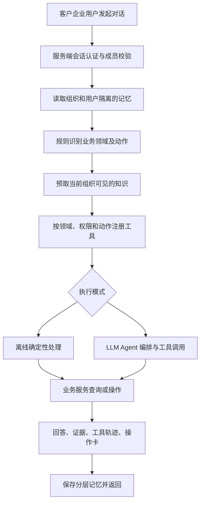

# EchoMind 当前实现总结

核对日期：2026-09-10。依据当前源码、已保存的实施记录和测评报告整理；不是待实现方案。本次仅生成文档，没有重新运行付费模型测评。

## 1. 项目定位与实现边界

当前确认的定位是：**面向使用 B2B SaaS 产品的企业用户，提供产品功能咨询、API 对接支持、订阅与账单管理、企业账户管理的工具驱动 Agent。**

EchoMind 是服务入口；FlowForge Cloud 是承载业务能力的虚构 SaaS 产品。登录者是客户企业中的 owner、admin、billing_admin、developer。组织是数据隔离边界，服务端根据真实成员身份判定操作权限。

仓库保留原分析模式，同时新增 V2 业务模式。理解项目时必须区分这两条运行链路：

| 维度 | 原分析模式 | V2 业务模式 |
|---|---|---|
| 入口 | `api/main.py` 中原 FastAPI 应用 | `ECHOMIND_DEMO=1` 时替换为 `api/demo.py` 创建的应用 |
| 核心用途 | 客户运营、交付、技术支持、续费分析 | 客户企业用户咨询和有权限约束的业务操作 |
| 意图识别 | LLM、模板匹配、规则融合 | `domain + domains + action` 规则分类 |
| Agent 执行 | 原编排器与角色工具 | 默认确定性演示；显式启用 LLM 后复用原编排器 |
| 记忆 | Redis + Chroma，主要按用户隔离 | SQLite 或 Redis + Chroma，按组织和用户隔离 |
| 知识检索 | Chroma + 查询改写 + LLM 重排 | 独立 Chroma 集合、组织与版本过滤；默认字符向量 |
| 监控 | PerformanceMonitor、可选 Prometheus、告警 | 独立 BusinessMonitor、持久轨迹、阶段指标、Prometheus 与租户内告警摘要 |
| 评测 | 意图指标、LLM Judge、基线比较 | 与 HTTP 共用 ChatService 的业务状态测评 |

**V2 即使启用模型，也不会自动启用原模式的融合意图识别、复杂 RAG 或 PerformanceMonitor。** 它替换的是 Agent 执行方式，分类器、知识库和记忆仍采用 V2 实现。

代码入口：[api/main.py](../api/main.py)、[api/demo.py](../api/demo.py)、[saas/chat.py](../saas/chat.py)。

## 2. V2 请求的完整处理链路



`ChatService.handle()` 的耗时从进入处理函数开始，包含并发准入等待、记忆读取、分类、检索、Agent 执行和记忆写入；不包含外部网络传输及完整 HTTP 生命周期。并发准入上限为 4，总处理超时为 90 秒。

业务状态来自 SQLite 中的 `SaaSService`。知识与历史记忆不能充当当前账单、订阅、席位或权限的事实来源。

## 3. 意图识别

### 3.1 原模式：融合识别器

实现：[core/intent_recognizer.py](../core/intent_recognizer.py)。

`IntentRecognizer.recognize()` 同时使用：

1. LLM 分类：结合消息和会话历史，返回意图、置信度与理由。
2. 模板向量匹配：对问题与意图模板进行相似度比较；模板向量延迟加载并缓存。
3. 关键词和模式匹配：补充具体意图，并在一定条件下细化泛化分类。

默认融合权重为 LLM 0.7、模板 0.2、规则 0.1；设置自定义 `base_url` 时禁用模板向量分支，改为 LLM 0.85、规则 0.15。LLM 调用失败时，优先使用有效模板结果，再使用规则结果。

融合分数低于默认阈值 0.5 时输出 OTHER；编排器可对低置信 OTHER 进行澄清。识别器还提取实体并计算紧急程度。

需要准确理解的细节：

- 当前标准 Anthropic 客户端没有代码尝试访问的 embeddings 资源时，模板匹配采用本地 256 维字符 n-gram 哈希向量。不能把它描述成已接入 Voyage 语义模型。
- 缓存键包含消息和历史信息，容量到 1000 时批量移除较早插入的 500 项；命中不调整顺序，因此并非严格 LRU。
- `learn()` 是增加内存中的纠正模板、使模板向量缓存失效，没有模型训练和持久化学习闭环。
- 融合置信度是启发式分数，不是经过校准的正确概率。

### 3.2 V2：业务领域与动作分类

实现：[core/business_intent.py](../core/business_intent.py)。

返回三个字段：

| 字段 | 含义 | 示例 |
|---|---|---|
| `domain` | 当前主领域 | `integration` |
| `domains` | 命中的全部领域 | `[integration, billing]` |
| `action` | 请求动作 | `read`、`preview`、`change` |

领域包括 product、integration、billing、account。规则匹配 API、401、429、账单、升级、成员、邀请等词；未匹配时归 product。带“那、它、现在、继续”等表达的部分追问，可以继承上一条用户消息的领域。

动作识别区分明确变更请求、咨询、否定和预览，例如“下周期升级到 Growth”归 change，“不要升级套餐”归 read。规则只影响路由和工具暴露，**不授予操作权限**。

V2 构造编排请求时预先设置意图，跳过原融合识别器。因此不能用原模式的三路融合描述当前业务意图链路。

局限：有限关键词和正则容易受复杂句式影响，没有槽位状态机或系统性语言理解评测。离线执行中含“如何、怎么、支持”等词的请求优先走咨询分支，可能不主动查询故障记录。

## 4. 多 Agent 路由与工具执行

### 4.1 角色与协作方式

实现：[agents/agent_orchestrator.py](../agents/agent_orchestrator.py)。

仓库定义 Triage、Delivery、Support、Success、Renewal，以及升级处理角色 Escalation。原模式依据意图、实体、关键词、紧急程度等信息选主 Agent，并识别跨领域协作需求。

V2 模型模式采用明确映射：

| 业务领域 | 主 Agent | 主要能力 |
|---|---|---|
| product | TriageAgent | 功能与套餐咨询 |
| integration | SupportAgent | API、Webhook 和请求故障支持 |
| billing | SuccessAgent | 订阅、账单和套餐变更 |
| account | SuccessAgent | 成员查询和邀请 |

只读多领域请求可以添加最多 2 个辅助 Agent，使用 `asyncio.gather()` 并行执行，再由 `ResponseComposer` 合成结果。change/preview 请求只选一个主 Agent，避免多个 Agent 重复操作。

当前每类 Agent 默认只有一个实例。已有依据成功率、耗时和监控惩罚系数进行同类实例选择的机制，但单实例池不能展示真正的同类负载分配。V2 领域路由中的 `confidence=1.0` 是固定规则输出，不是测得的分类置信度。

**离线模式直接执行确定性分支，不会实际调用多 Agent。** 响应中显示领域名称也不意味着发生了模型协作。

### 4.2 工具调用约束

工具定义与适配：[agents/tools.py](../agents/tools.py)、[saas/agent_tools.py](../saas/agent_tools.py)。

工具元数据包含输入 schema、领域、效果类型 read/prepare/write 和权限要求。注册时按用户角色、任务领域、动作类型过滤；执行时再次查询服务端权限。

模型经 `tool_use → 工具执行 → tool_result` 循环取得结果，默认最多 3 轮模型调用；这不是“最多调用 3 个工具”。同一轮中的多个工具调用按序处理。

V2 业务 Agent 在请求已授权工具集合上按专业领域进一步裁剪：Support 负责 integration，Success 负责 billing/account，Triage 负责 product。公共只读工具保留，写请求仅由主领域处理；工具执行仍重复鉴权。

每次调用有独立任务提示、领域证据和结果累积区，共享会话记忆用于理解指代。并行结果必须包含 `summary/evidence_ids/missing/next_steps`，字段类型和引用来源经过校验。Composer 面向 SaaS 企业用户合并；专业 Agent 失败不回退到拥有不同职责的 Triage，保留部分失败提示。详见 [专业化分工](specialization-v2.md)。

可靠性约束包括：

- 每个 Agent 实例用锁保护请求期间的可变轨迹状态。
- 单 Agent 执行默认 45 秒超时；业务工具执行默认 10 秒超时。
- 业务 change/preview 失败后不换另一个 Agent 重试。
- 写工具超时返回 unknown，提示查回执；线程超时不代表底层事务一定停止。
- 预览请求不暴露 write 工具；订阅确认端点和模拟时钟均不向模型注册。

订阅变更需要先生成绑定用户、组织、参数、资源版本、规则版本和有效期的预览，再由用户在界面确认。操作成功回执、业务修改和审计记录一起提交，重试返回原回执。邀请仅生成本地 developer 待接受邀请，不发送邮件。

该编排是固定角色、规则路由和工具循环的轻量实现，没有通用任务规划器、动态协作图、持久化工作流恢复或分布式 Agent 调度。目录名 `mcp` 中的工具管理器也不能单凭名称视为已实现完整 MCP 协议服务。

## 5. 分层记忆

### 5.1 原模式

实现：[memory/conversation_memory.py](../memory/conversation_memory.py)。

| 层级 | 存储与范围 | 当前实现 |
|---|---|---|
| 工作记忆 | Redis，用户 + 会话 | 消息列表，TTL 24 小时；通常读取最近 20 条 |
| 会话摘要 | Redis，用户 + 会话 | 达到 15 条消息时，对旧消息生成 LLM 摘要，保留最近 5 条；累计摘要截取到 3000 字符 |
| 情景记忆 | Chroma `episodic`，用户范围 | 保存摘要，元数据仅保留原片段前 500 字符；按查询召回最多 5 条 |
| 用户画像 | Chroma `user_profile`，用户范围 | LLM 提炼偏好与实体，合并变更，包含敏感字段过滤和兼容旧记录逻辑 |

消息写入按会话加进程内锁，画像更新按用户串行化。摘要生成失败或 Chroma 归档失败时保留原始工作记忆；成功后用 `LTRIM` 保留最新消息，避免重写列表造成顺序反转。

原模式主要依赖 `user_id` 隔离，没有 V2 的组织授权边界，不能直接当成面向客户企业用户的多租户安全实现。

### 5.2 V2

实现：[saas/memory.py](../saas/memory.py)。

| 层级 | 默认存储 | 范围与策略 |
|---|---|---|
| 工作记忆 | SQLite `conversations`，可选 Redis | 范围键由组织、用户、会话共同生成；Redis TTL 为 24 小时，SQLite 没有自动 TTL 清理 |
| 情景记忆 | Chroma `flowforge_episodes_v1` | 范围键由组织和用户生成，允许同用户跨会话检索；Top-2 |
| 显式偏好 | Chroma `flowforge_profiles_v1` | 按组织和用户保存当前偏好；识别“请简洁”或“use English”等有限表达 |

每轮写入用户与助手两条消息，超过 16 条时把较旧部分序列化，最多截取 4000 字符写入 Chroma，工作记忆保留最近 8 条。先归档后裁剪，防止归档失败时清掉已存历史。

这里采用的是**截取式片段归档**，不是 LLM 摘要压缩；长片段仍可能因字符上限丢失信息。偏好是单条记录覆盖，不是复杂画像融合。默认只在一个进程内协调写入，没有分布式锁和完整记忆生命周期治理。

传给 Agent 的上下文明确提示：历史不能证明当前权限、账单或套餐状态，需要重新查询业务工具。

## 6. RAG 检索

### 6.1 原模式：改写、召回与重排

实现：[mcp/knowledge_base.py](../mcp/knowledge_base.py)、[mcp/tool_manager.py](../mcp/tool_manager.py)。

基础知识库使用 Chroma `knowledge_base` 集合。文档按句号和换行聚合，以约 500 字符为目标切片，没有 overlap；遇到超长单句可能超过目标长度。保留标题、片段序号和总片段数，使用 Chroma 默认 embedding function。

不能把“连接 Chroma HTTP 服务”理解为已配置服务端模型推理：源码只是使用默认 embedding function，实际向量生成位置及模型下载行为依赖安装版本和客户端配置。

增强检索路径为：

```text
原查询 → LLM 生成 3 个改写查询并保留原查询
       → 多查询并行召回 → 合并去重 → LLM 排序 → Top-K
```

查询改写失败时使用原查询，重排失败时保留原顺序。工具管理器提供参数检查、缓存、超时、熔断和 fallback；原知识工具注册缓存 TTL 为 300 秒。原 `/chat` 对证据敏感问题主动预取知识，其他问题允许 Agent 按需调用检索工具。

边界与细节：

- 这不是 BM25 与向量融合的混合检索；“主动预取 + 按需调用”是触发方式组合。
- 去重使用整个结果对象的字符串哈希，不是稳定 chunk ID；同一内容携带不同分数时可能去重不充分。
- 默认集合没有显式设置 cosine 距离，返回的 `1 - distance` 不能直接宣称为余弦相似度或置信概率。
- 重排标志并不保证发生了成功的模型重排，少量候选或失败回退均需结合轨迹判断。
- 尚无已验证的 Recall@K、MRR、nDCG 或改写/重排消融收益。

### 6.2 V2：隔离与可复现优先

实现：[saas/knowledge.py](../saas/knowledge.py)、[saas/seed.py](../saas/seed.py)。

使用独立集合 `flowforge_v1_lexical`；可选 `minilm` 使用另一集合。默认 lexical 是 512 维字符 n-gram 哈希向量，显式采用 cosine 距离，适合离线重复测试，不应等同于训练后的语义检索模型。

种子数据共 34 条：30 条当前公共规则、3 条组织历史快照、1 条过期负例。涵盖产品、API 集成、账单订阅、企业账户。每份短文档直接作为一条记录，未使用原模式的分块器。

元数据包含来源 ID、标题、组织、版本、有效标志和文档类型。查询前以 Chroma `where` 限定公共或当前组织、有效文档、当前规则版本；主链路预取 Top-3。工具还可以按需追加检索结果。

使用稳定来源 ID 进行 upsert，可重复导入。引用返回来源、版本、组织、内容和距离。静态快照用于历史背景，实际订阅和用量通过工具查询 SQLite。

V2 未接入原工具管理器的查询改写、结果缓存、熔断和重排；也没有独立的引用支撑度判定或检索相关性阈值。返回 citations 表示提供了依据，并不证明回答逐项被依据支持。

## 7. 监控与可观测性

### 7.1 原模式

实现：[monitor/performance_monitor.py](../monitor/performance_monitor.py)。

默认每 10 秒采集 Agent 和工具统计，包含成功率、平均耗时、工具连续失败及熔断状态。支持滑动窗口异常检测、阈值告警、处理建议、可选 webhook 和 Prometheus 导出。

默认阈值：Agent 成功率低于 90%、工具成功率低于 95%、Agent 平均耗时高于 3000 ms、工具平均耗时高于 5000 ms。监控将失败率与慢响应转换为惩罚系数，回传同类 Agent 实例评分。

需要区分指标语义：

- Agent 成功率主要表示执行成功，不等于客户问题真正解决。
- 模型工具轨迹区分 `success`（调用过程是否异常）和 `result_success`（业务结果是否成功）。
- Prometheus 延迟直方图采样的是周期性平均耗时，不能用于宣称逐请求 P95 延迟。
- `requests_total` 虽有定义，在该采集代码中未见实际递增，不能视为完整请求计数。
- 原接口返回的 `latency_ms` 主要来自编排器，不包含全部 HTTP 链路中的记忆与预取开销。

### 7.2 V2

V2 未启动原 PerformanceMonitor；已接入独立的 BusinessMonitor，实现自己的 `/monitor`、`/metrics`、`/ready` 与轨迹接口。原 `/eval/run` 仍未接入。完整口径见 [V2 监控说明](./observability-v2.md)。

已具备：

- `/health`：运行状态、执行引擎、工作记忆后端、embedding 类型。
- `/knowledge/stats`：知识条数与集合名称。
- `/trace/tools`：限定当前组织和用户，默认返回 20 条，可查询单条请求；独立 SQLite 默认按写入清理至 7 天、全局最多 10,000 条。
- `/chat` 返回 request_id、领域、动作、工具轨迹、引用、操作回执及处理耗时。
- SQLite 业务审计和操作表：持久保存成功变更、操作者和回执，用于重复提交及结果核验。

离线与模型模式统一记录工具状态和耗时，持久轨迹不保存问题、回复、原始工具参数和异常正文。新增排队、记忆、分类、检索、模型等阶段耗时；业务拒绝与技术失败分开统计，失败和超时请求也保留轨迹。HTTP 编号与 ChatService 请求编号一致，可关联业务操作回执。

`/monitor` 展示本人最近 24 小时保留样本的分位数及阈值告警；告警在查询时计算，不向外推送。Prometheus 对逐请求耗时采样，使用独立运维凭证，指标重启归零。模型 token 仅记录实际返回的 usage，未提供费用估算或完整分布式追踪。

## 8. 评测与已有验证

### 8.1 原模式评测

实现：[evaluation/evaluator.py](../evaluation/evaluator.py)。

- 意图评测：accuracy、macro-F1 和逐例结果。
- 对话评测：支持单轮和多轮，调用编排器产生回答，再由 LLM Judge 从相关性、准确性、完整性、有用性评分。
- 回归评测：与保存的基线比较，输出退化项和建议，并保存报告作为后续比较依据。

原对话评测直接调用编排器，用局部历史构建上下文，未完整经过 `/chat` 的真实记忆读取和知识预取链路，因此不能视为所有在线行为的端到端验收。Judge 分数也不能替代真实业务状态断言。

### 8.2 V2 状态评测

实现：[evaluation/business_evaluator.py](../evaluation/business_evaluator.py)。

5 个任务模板 × 3 个组织 × 4 个角色，共 60 个参数化用例：产品咨询、API 请求查询、账单查询、订阅变更、成员邀请。

每例创建独立 SQLite 状态库，复用该次评测的 Chroma 知识库，通过与 HTTP 相同的 ChatService 和业务工具执行；评测程序独立于用户正在使用的演示数据库。

检查内容包括：

- 领域、证据组织范围、知识版本与业务事实是否正确。
- 无权限或席位不足时是否避免业务变更。
- 订阅确认前是否保持原状态，重试是否返回一致回执。
- 下周期生效后套餐和模拟账单金额是否正确。
- 邀请是否 pending、是否去重、是否避免实际发信。
- 非目标组织是否被意外修改，审计记录数量是否正确。

订阅确认与时钟推进由评测程序模拟用户和测试控制动作，不是 Agent 自主完成。数据库状态断言主要验证工具与业务服务；通过并不保证所有自然语言解释正确。

已有证据：

| 项目 | 保存的结果 | 解释范围 |
|---|---|---|
| 业务状态矩阵 | 60/60 通过 | 60 个参数组合，不是 60 个独立编写的复杂任务 |
| 该次 ChatService 延迟 | P50 47 ms，P95 63 ms | 离线引擎；不包括 seed、用户确认与时钟推进；不是 LLM 延迟 |
| 回归测试 | 实施记录记载 34 项通过 | 覆盖工具契约、权限、幂等、并发席位、Chroma、记忆等 |
| 前端 | 实施记录记载构建与浏览器流程通过 | 不代表生产部署或压测完成 |

报告：[eval-v2-report.json](./eval-v2-report.json)。生成于北京时间 2026-09-09 00:00:15 左右，记录的执行基准为 `2789618`，引擎 `deterministic_demo`，模型为空。本次文档总结引用已有结果，没有重跑或扩写指标。

补充测试入口：[tests/test_business_agent.py](../tests/test_business_agent.py)、[tests/test_saas.py](../tests/test_saas.py)、[tests/test_saas_routes.py](../tests/test_saas_routes.py)、[tests/test_saas_knowledge.py](../tests/test_saas_knowledge.py)、[tests/test_saas_memory.py](../tests/test_saas_memory.py)、[tests/test_memory_compression.py](../tests/test_memory_compression.py)。

尚缺独立的真实模型业务成功率、复杂多轮任务、提示注入与越权对抗集、RAG 召回质量、引用忠实度、token 成本，以及多 Agent 相对单 Agent 的对照实验。

## 9. 当前最适合的项目表述

> 实现面向 B2B SaaS 企业用户的工具驱动服务 Agent，以组织隔离的业务服务为执行基础，覆盖产品咨询、API 支持、订阅账单和成员管理；复用多 Agent 工具调用框架，接入分层记忆与版本化知识检索，并通过独立业务状态评测验证权限、确认、幂等和审计闭环。

可深挖的工程点是：用户意图与权限分离、读写工具约束、订阅预览确认状态机、跨组织检索与记忆隔离、失败时的回执查询和状态评测。

不宜表述为“V2 已集成三路融合意图、语义混合检索、智能长期记忆和在线自优化路由”，也不宜把离线 60/60 结果写成模型业务成功率 100%。原模式的能力可以作为已有实现单独介绍，接入范围必须说清楚。

## 10. 运行与复核入口

```powershell
# 在仓库根目录执行；默认不调用付费模型。
.venv/Scripts/python -m saas.seed --output data/flowforge
$env:ECHOMIND_DEMO='1'
$env:ECHOMIND_DEMO_LLM='0'
.venv/Scripts/python -m uvicorn api.main:app --host 127.0.0.1 --port 8000

# 在另一个终端复跑软件验证。
.venv/Scripts/python -m unittest discover -s tests -q
.venv/Scripts/python -m evaluation.business_evaluator --output data/eval/business-report.json
```

模型执行需显式设置 `ECHOMIND_DEMO_LLM=1` 并配置可用的提供商和模型；评测的 `--engine llm` 同样会实际调用模型。Windows 使用 Chroma 1.0.20，Linux 依赖保留 0.5.23；已有实施验证针对 Windows，不能据此宣称两个环境均已完成验证。

更多安装、数据保留和演示步骤见 [implementation-v2.md](./implementation-v2.md)；MVP 验收范围见 [spec-b2b-saas-v2.md](./spec-b2b-saas-v2.md)。
